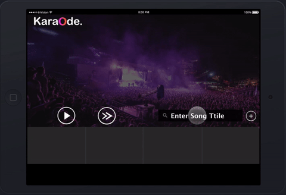

# KaraO-Notation
Emory Hackathon V

## Inspiration
We fell in love with Dave's pitch for a karaoke website. We wanted to make a karaoke website that was more accessible for the user then the many karaoke applications that are online.

## What it does
Our project takes in youtube music links and plays it with muted vocals and lyrics on the side that are synced in real time to deliver the best karaoke experience.

## How I built it
We first drew mockups of the design that we wanted. We tried to find API's that could work for our project. 

## Challenges I ran into
There were two ways we thought of implementing our idea. So we could either take the youtube links and find lyrics that match the song from a song database or we could use text-to-speech input to output the lyrics. We had trouble matching the timing of the lyrics to the song. Our audio filtering was inconsistent, depending on the composition of the song the success of our filtering varied. We decided to write the API calls with javascript but I was unfamiliar with javascript so I spent a lot of time figuring out how to translate java code into javascript. We also had design conflicts in choosing between a moving, flashy background or a static, simple background. 

## Accomplishments that I'm proud of
We gained vital exposure in javascript, a language that we all for the most part were novices in. We learned about UI/UX from our team leader, Dave. We had a working program that muted the vocals of a song, allowing the users to use their voices. We made progress finding a way to match vocals with the lyrics within our time frame.  For many of us, it was our first hackathon. Thus, it was rewarding to see our product at the end of the day.

## What I learned
I learned some javascript and how API calls are made with javascript. From a design standpoint I also learned the importance of the flow of the user interface. From a team standpoint we learned how to manage our time and set incremental goals to meet for our project. We learned about the six step SPRINT method( understand, define, diverge, decide,prototype) that was used as an outline for our project. We learned have to use Node.js

## What's next for KaraO-Notation
So far we input mp3 files to our program so for additional functionality we will have to make it work for youtube links. For the lyrics we can add a highlighting functionality where the individual letters are highlighted to match the timing of the song.

## Clickable Prototype
https://invis.io/SGB0U0AD7

